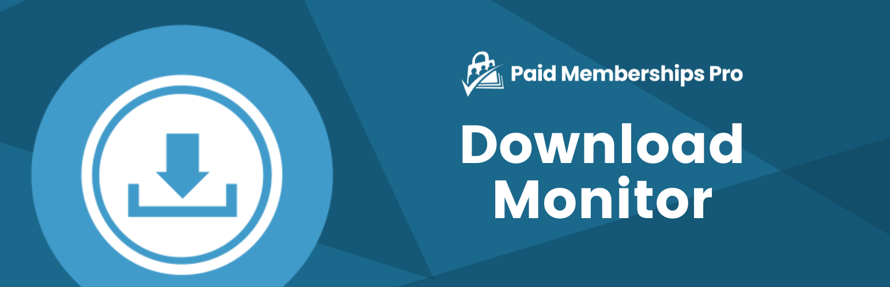

# [Paid Memberships Pro - Download Monitor Integration](Paid Memberships Pro - Download Monitor Integration) #
[comment]: # (Generate badges from shields.io, only works for .org plugins to get other stats etc. We'd have to create our own endpoints for Premium plugins)

### Welcome to the Paid Memberships Pro - Download Monitor Integration GitHub Repository
Protect downloads for members only and charge for access to downloadable files using [Download Monitor and Paid Memberships Pro](https://wordpress.org/plugins/download-monitor/).

For more information please visit [Paid Memberships Pro - Download Monitor Integration](https://linktoplugin.com)

## Installation ##
For detailed installation steps, visit the [Paid Memberships Pro - Download Monitor Integration](https://linktoplugin.com) page.

1. Download the current development ZIP file directly: `https://github.com/strangerstudios/pmpro-download-monitor/archive/dev.zip`

**Please ensure that once installing this version of the plugin to remove `-dev` from the plugin's folder name.**

## Bugs ##
If you find an issue/bug, let us know by [creating a detailed GitHub issue](https://github.com/strangerstudios/pmpro-download-monitor/issues/new).

## Support ##
This is a developer's portal for Paid Memberships Pro - Download Monitor Integration. We do not offer support on this channel. **Any support related questions should be directed to [paidmembershipspro.com/support](https://www.paidmembershipspro.com/support/).**

## Contributing to Download Monitor Integration ##
We encourage and welcome any contribution to Download Monitor Integration. Please read the [guidelines for contributing](https://github.com/strangerstudios/pmpro-download-monitor/blob/dev/.github/CONTRIBUTING.md) to this repository.

There are various **ways to the help development** of Download Monitor Integration:

1. Report [bugs/issues](https://github.com/strangerstudios/pmpro-download-monitor/issues/new) on GitHub.
2. Work on any issues by submitting a Pull Request.

Here are some ways for **non-developers to contribute** to Paid Memberships Pro - Download Monitor Integration:

1. Translate Paid Memberships Pro - Download Monitor Integration into your own [language](https://www.paidmembershipspro.com/paid-memberships-pro-in-your-language/).
2. [Purchase a paid membership](https://paidmembershipspro.com/pricing) to help fund ongoing development and bug fixes.
3. Leave an honest review for [Paid Memberships Pro - Download Monitor Integration](https://www.paidmembershipspro.com/submit-testimonial/).